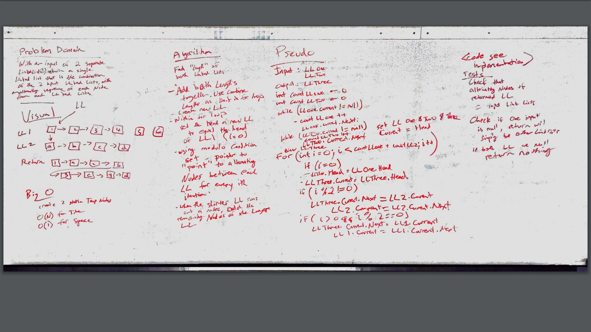

# Merge Two Linked Lists
## Description
Given two linked lists, merge them together like a zipper

## Approach and Efficiency
Big O Time: O(n) // Big O Space: O(1)
- Time is O(n) because we have traverse the Linked Lists
- Space is O(1) because we don't instatiate any new objects

## Solution
