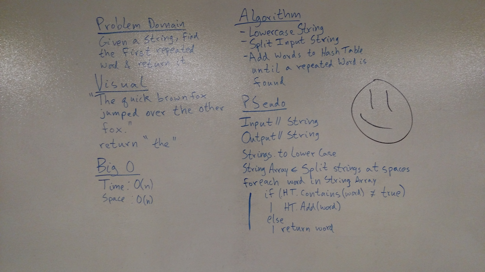

# Repeat Word
## Challenge
Given a String of considerable length, return the first word that is repeated.

## Approach and Efficiency
Big O Time: O(n) // Big O Space: O(n)
- Time is O(n) because have to iterate over the string twice: once to split into words and a second time to determine if there are repeats.
- Space is O(n) because we have to make an array and a hash table.

## Visual
