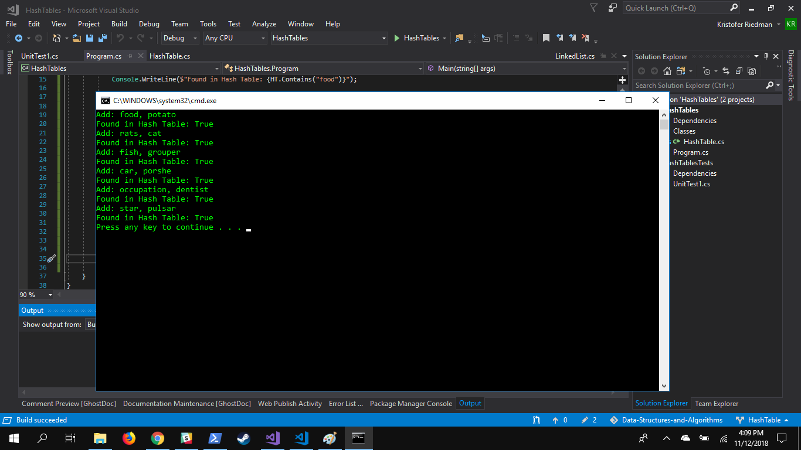

# Hash Tables
## Description
A Hash Table is a data storage system stores key value pairs based on a unique value that corresponds to an index in the Hash Table

## Implementation
For this implementation, a Hash Table is an array of Linked Lists. To determine where data is stored, we use an algorithm to create a hash based on the key of the data to be stored. If the index where the data to be stored is not empty, the data is added to the Linked List located in the index.

## Use Cases
- Dictionaries
- Can be used to implement a Cache

## Visual
