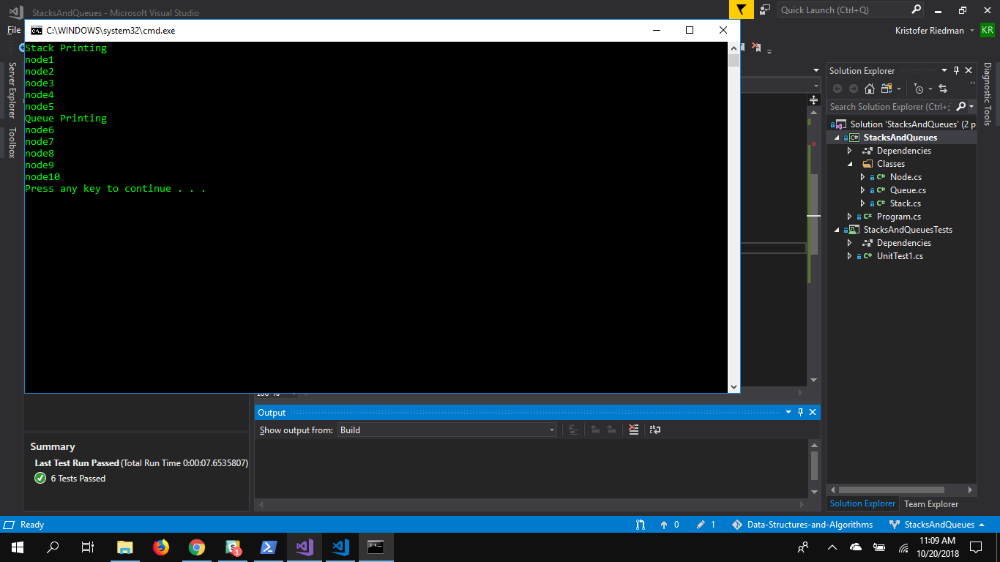

# Stacks and Queues
## Description
- A Stack is a data structure that is built around the concept of Last In First Out or LIFO: the last value that was added to the Stack is the first to be removed from the Stack.
- A Queue is a data structure that is built around the concept of First In First Out or FIFO: the first value that was added to the Queue is the first to be removed from the Queue.

## Implementation
Both Stacks and Queues use node objects. 
### Stack
A Stack has a Top property which is the Node at the top of the Stack. A Stack's Constructor requires a Node to be set as the Top. Stacks have three methods: Pop, Push, and Peek. Peek looks at the top node of the Stack, Push adds a node to the top of the Stack, and Pop removes the top node from the Stack.
### Queue
A Queue has a Front property, the first node in the Queue, and a Rear property, the last node in the Queue. A Queue's Constructor requires a node to be set as the Front and the Rear. Queues have three methods: Enqueue, Dequeue, and Peek. Peek looks at the first node of the Queue, Enqueue adds a node to the Rear of the Queue, Dequeue removes the Front node from the Queue.

## Use Cases
### Stacks
- Back/Forward functionality on web browsers
- A garage that is only one car wide: you have to remove the first two cars to get to the third car
### Queues
- CPU/Disk scheduling: when multiple processes require CPU at the same time
- Call center phone systems to hold people in line until a representative is free

## Visual
