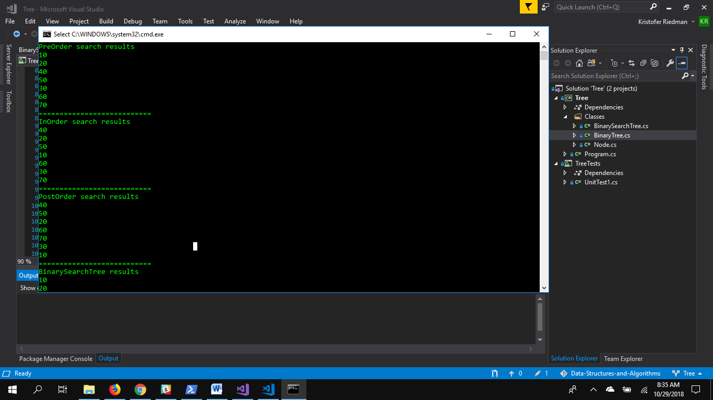
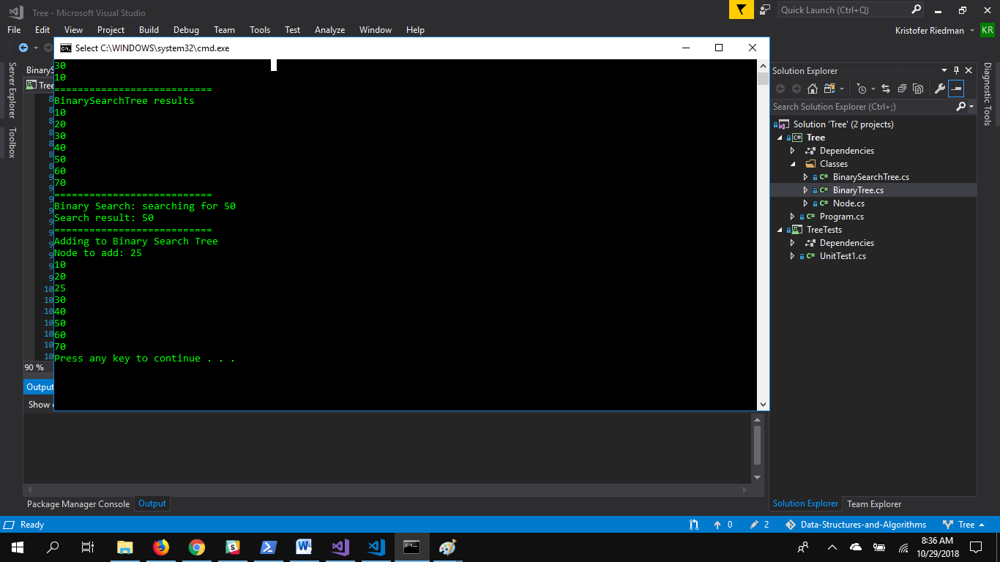

# Trees
## Description
A Tree is a Data Structure composed of Nodes.  Unlike a Linked List, the Nodes in a Tree can point to more than one Node. A Binary Search Tree is a Tree of sorted Nodes: lowest value on the left and highest value on the right.

## Implementation
In a Binary Tree, each Node points to a Left Node and a Right Node. The first Node in the Tree is called the Root and any Node without a Left or Right Node is called a Leaf.

## Use Cases
- Binary Space Partition: Used in almost every 3D video game to determine what needs to be rendered.
- GGM Trees: Used in cryptographic applications to generate random numbers

## Visual

